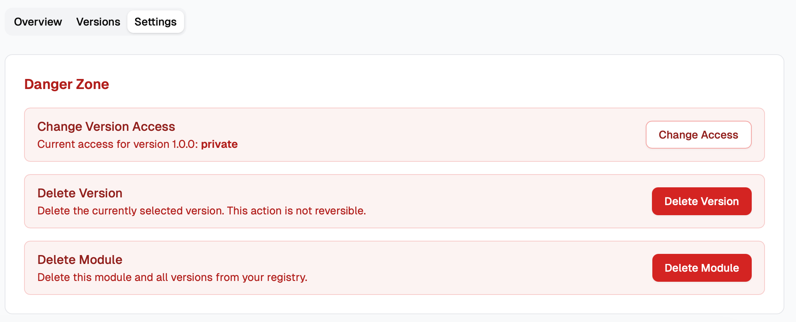

This week we are introducing module visibility control in Unmold, with explicit `private` and `public` access levels per module version.

<!-- truncate -->

### What is new?

Unmold now supports per-version visibility controls that let you decide how each published module version should be shared:

* `private` (default): requires authentication for listing and download
* `public`: allows unauthenticated listing and download

This gives teams better control when they want to keep internal versions restricted while selectively sharing stable versions publicly.

### Publishing a public module

New versions are private by default. To publish a version as public, set access explicitly:

```bash
unmold module publish <module-name> <version> --access public
```

If `--access` is omitted, the version remains private.

### Update visibility after publication

You can change visibility at any time using the unmold CLI commands:

```bash
unmold module make-public <module-name> <version>
unmold module make-private <module-name> <version>
```

or using the module setting at Unmold console:



It allows you to upload private modules in the release workflow and selectly promote certain versions for public access later.

### Why this matters

Teams usually need both strict internal control and smooth external sharing.

With visibility control, you can:

* keep in-progress or sensitive versions private by default
* make only approved versions public
* support mixed workflows across CI, Terraform, and OpenTofu without changing source patterns

This update also improves anonymous discovery behavior by ensuring unauthenticated listing only returns public modules.

### Related docs

* [Module access](/docs/module/access)
* [Module publication](/docs/module/publication)
* [Module usage](/docs/module/usage)
* [CLI publish](/docs/cli/module/publish)
* [CLI make-public](/docs/cli/module/make-public)
* [CLI make-private](/docs/cli/module/make-private)

If you have feedback on visibility defaults or sharing workflows, join the [Unmold community](https://github.com/orgs/unmold-cloud/discussions).
